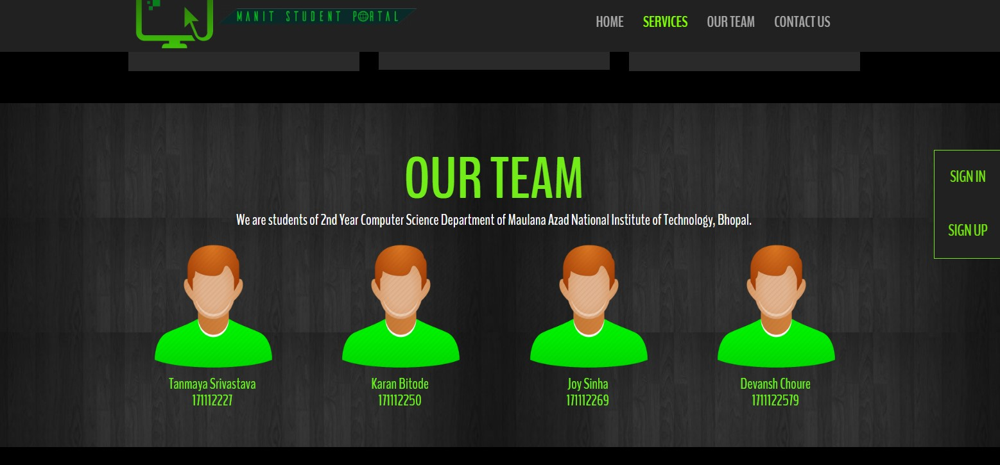
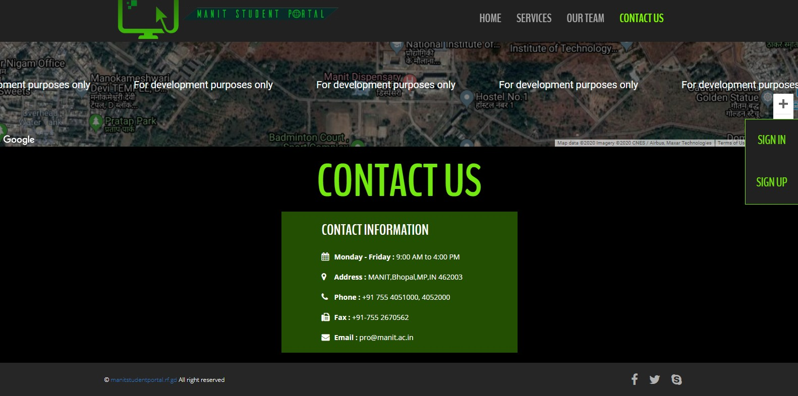
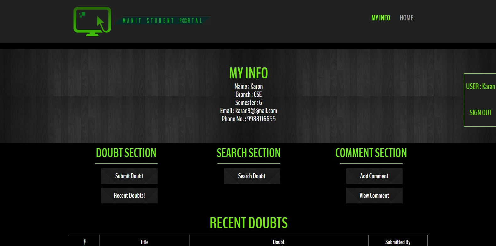
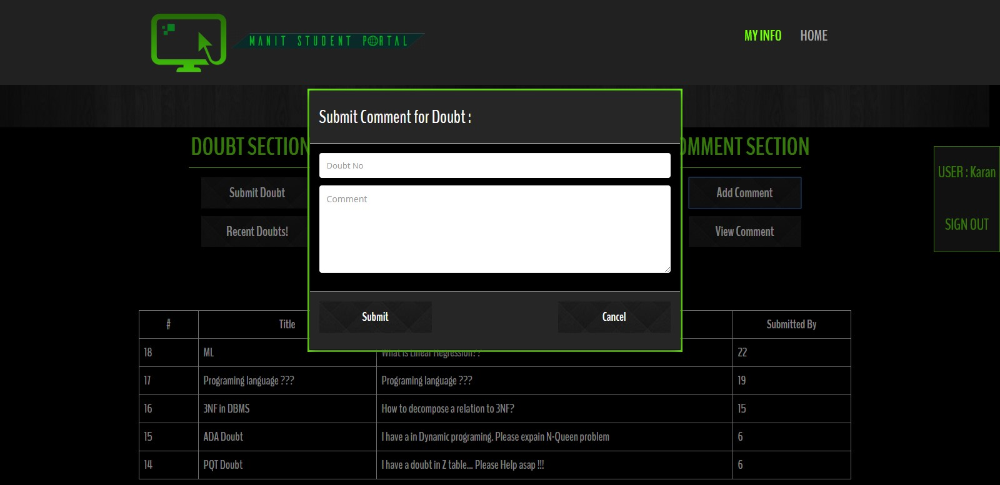
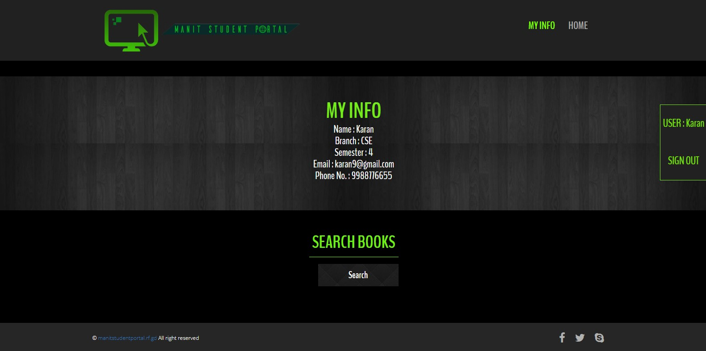

# Student-Doubt-Portal http://manitstudentportal.rf.gd 
A website whose purpose was to give a platform, namely “MANIT Student Portal”, to students of our college for posting their doubts among other features. Technologies involved were HTML, CSS, Basic Bootstrap, PHP, SQL. As a Main Designer and Developer. http://manitstudentportal.rf.gd 

